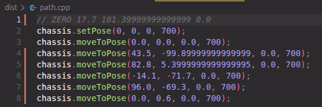
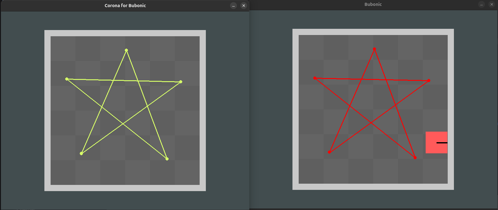

# Corona For Bubonic by glasseshead (David Sun)
A solo-programmed VEX V5 program made with Python for Autonomous visualization using a digital plottable field.
Made for use with Plague? Where? and Bubonic by David

Thanks Zachary from 5776K; Kabir & Norrel from 5776A; Aarav from 5776T; Jerry from CMAA

Think of Bubonic as where the code is written and you can see the path the robot takes, and Corona is a visualizer where code is sent to be drawn.

## Usage
When you first install Corona For Bubonic from this link:

[https://github.com/glasseshead/bubonic-corona_install](https://github.com/glasseshead/bubonic-corona_install)

You should recieve a .zip file in either `Downloads` or your specified file location. 

Go to that file location in your filesystem, and unzip the file.

After unzipping the file, you can go to `main`, where you should be able to access the file by making sure it is set to `"Run as a program"` or any similar settings. 

After doing so, you may peruse the below information to assist you in using Corona For Bubonic. Your `path.cpp` file will be in the same directory as `main`.

Have fun!

## Features
- **Path and pose visualizer**
  - Instead of plotting points, the user puts their program in path.cpp, where it is parsed into data
  - Using Bit-Boundary Block Transfer (blit), the code draws the path the robot theoretically takes

- **Visual rendering**  
  - VEX V5 blank field rendered in high quality supporting:
    - Robot
      - Robot theta indicator
   - Field Perimeter
    - Checkerboarded tiles
    - Path rendering
      - Lines from point to point in green

- **Plague? Where? and Bubonic compatability**
  - Designed to be compatible Plague? Where? and Bubonic for assisted autonomous programming

## Notes
- You are required to put in a path in path.cpp. A sample path is provided.
- Code does not recognize starting points, so it will start from the top left corner centered to the tile.
- May require pygame dependencies